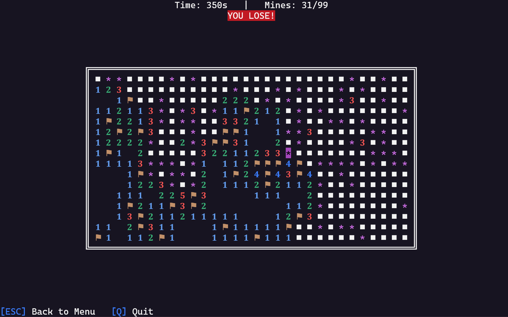

C++ Minesweeper
===============


This is a simple minesweeper game that runs directly in the terminal (with out-of-the-box **mouse** and **keyboard** navigation support). The project is implemented in C++, utilizing [ANSI escape codes](https://en.wikipedia.org/wiki/ANSI_escape_code). Terminal mouse and keyboard support was achieved by Win32 APIs (via `windows.h`), DOS console input/output APIs (via `conio.h`) on Win32 systems, and UNIX terminal input/output APIs (via `termios.h`, `sys/ioctl.h`, `unistd.h`) on UNIX systems.

The program is tested on Windows 11 (Version 22H2) and Windows Subsystem for Linux (Version 2.0.9.0).

See `demo.mp4` for demo gameplay.

Features
--------
1. **Gameplay**
- Customize board size (number of rows, columns and mines).
- First click guaranteed to be empty.
- Player can click on a opened cell with enough flags to quickly open all remaining neighbor cells.

2. **UI**
- Main menu: New game, Resume game (if exists), Quit.
- Start game menu: customize board size and number of mines.
- Game screen: Live timer and mines counter, colorful minefield.
- Pause screen, win screen and lose screen allow player to save game or go back to main menu to retry.
- **Auto re-render UI if detecting terminal resize.**
- **Auto notify player if current terminal size is too small to display the game screen after resize.**

3. **Control**
- By keyboard: use arrow keys to navigate through minefield, spacebar to open cell and `F` to flag cell, escape key to pause game, back to menu.
- **By mouse** (Windows only, not yet implemented for UNIX systems): hover effects, left click to select option / open cell, right click to flag cell.

4. **Other**
- Auto-save highscore (best time) for each board size combination.
- Options to save and resume game (with continued timer).
- Timer only starts after first move.

Compile and Run
---------------
If you have `make` on your system, simply run `make minesweeper` to build the project. Otherwise, you can compile it using the following command:
```bash
mkdir -p build/ && cd src/ && \
g++ -Wall -O2 -std=c++17 \
minesweeper.cpp game_controller.cpp ui_controller.cpp \
-o ../build/minesweeper \
-static-libstdc++ -static-libgcc \
-Wl,-Bstatic -lstdc++ -lpthread \
-Wl,-Bdynamic \
-Wl,--as-needed -Wl,--strip-all
```

Then, you can run `build/minesweeper.exe` or `build/minesweeper`.

Prebuilt binaries are also provided in the [Releases](https://github.com/huytrinhm/cpp-minesweeper/releases) section. However, the underlying architecture and system APIs differ from machine to machine and cannot be static-linked, be cautious that the prebuilt binaries may not work properly.

Project structure
-----------------
The `src/` directory includes:
1. `minesweeper.cpp`
- The entrypoint of the game.
- Contains core logic of the game loop and save/load game functionalities.

List of functions:
```cpp
bool gameLoop(GameState& state, bool isSaved);
void saveGame(const GameState& state);
bool loadGame(GameState& state);
void deleteSave();
void loadHighscores(int highScores[MAX_M][MAX_N][MAX_M * MAX_N], size_t size);
void saveHighscores(int highScores[MAX_M][MAX_N][MAX_M * MAX_N], size_t size);
int main(); // entrypoint
```

2. `game_controller.h`, `game_controller.cpp`:
- Utility library for managing game logic (create and manage game states).
- The game state is modeled as follows:
```cpp
struct GameState_s {
  bool board[MAX_M][MAX_N]; // 0: bomb; 1: empty
  int display[MAX_M][MAX_N]; // 0-8: numbers; 9: not yet opened; 10: flag; 11: bomb
  int rows, cols, bombCount, elapsedTime;
  bool generated;
};
```

List of functions:
```cpp
void initBoard(GameState& state, int rows, int cols, int bombCount); // initialize game state
void genBoard(GameState& state, int r, int c); // randomize minefield
bool inBound(const GameState& state, int r, int c); // check position is inside minefield
int updateDisplayPosition(GameState& state, int r, int c); // update mine count number
bool openPosition(GameState& state, int r, int c); // triggered when player click on a cell
void toggleFlagPosition(GameState& state, int r, int c); // triggered when player flag a cell
void openAllBomb(GameState& state); // game over procedure
bool isWinState(GameState& state);
```

3. `ui_controller.h`, `ui_controller.cpp`:
- Utility library for managing game UI (render menu and minefield, handle player mouse and keyboard inputs).
- Using preprocessor directive `#ifdef _WIN32` to implement platform dependent features (terminal input/output APIs, WIN32 APIs to capture mouse events).

List of functions:
```cpp
void initConsole();
void closeConsole();
void hideCursor();
void showCursor();
void getConsoleWidthHeight(int& width, int& height);
void clearScreen(int mode);
void clearScreenInline(int mode);
bool screenToBoard(GameState& state, // convert screen coordinates to board coordinates
                   int screen_r,
                   int screen_c,
                   int& board_r,
                   int& board_c);
void render(const GameState& state, // render game board
            int cursor_r,
            int cursor_c,
            bool skipHeader = false,
            bool skipBoard = false,
            bool skipFooter = false);
int getInput(); // platform-specific get keyboard input
bool getMouseInput(int& r, int& c, int& event); // platform-specific get mouse input (TODO: implement for UNIX system)
int mainMenu(bool saved); // render main menu
void startGameMenu(int& rows, int& cols, int& bombCount); // render start game menu
bool loseMenu(const GameState& state, int cursor_r, int cursor_c); // render lose menu
bool winMenu(const GameState& state, int bestTime); // render win menu
int pauseMenu(const GameState& state); // render pause menu
void wait(); // wait for keyboard input
```

Gameplay
--------

Main menu:


Start game menu:


Game screen:


Lose screen:


Win screen:

